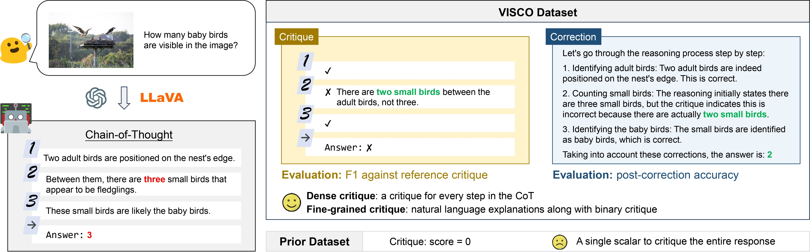
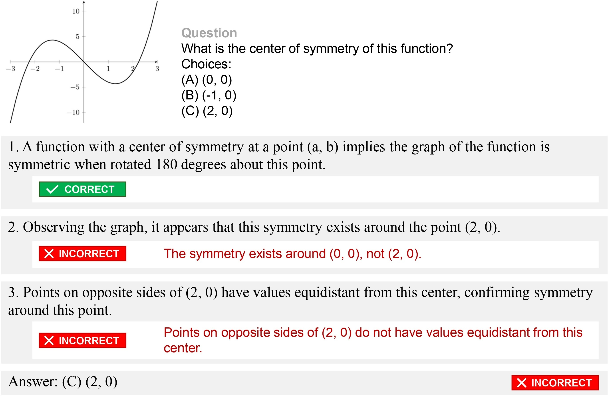

# VISCO

**Benchmarking Fine-Grained Critique and Correction Towards Self-Improvement in Visual Reasoning**

[🌐 Project](https://visco-benchmark.github.io/) | [🤗 Dataset](https://huggingface.co/datasets/uclanlp/VISCO) | [📖 Paper](https://arxiv.org/abs/2412.02172)

<br/>

Outline:
* [Introduction](#introduction)
* [Data](#data)
* [Environment](#environment)
* [Run models](#run-models)
* [Run evaluation](#run-evaluation)

## Introduction

VISCO is a benchmark for evaluating the critique and correction capabilities of LVLMs. VISCO contains:
1. **1645 pairs of questions and LVLM-generated answers**. Each answer includes a chain-of-thought with multiple reasoning steps.
2. **5604 step-wise annotations of critique**, showing whether each step is correct or incorrect, along with a natural language explanation if a step is incorrect.



## Data



Please download our data from [here](https://huggingface.co/datasets/uclanlp/VISCO). Due to the variable data type, the huggingface dataset viewer does not work properly. Please use [browse-data.ipynb](browse-data.ipynb) to browse the data. 

Each line in `test.jsonl` corresponds to a data point, with a question, an LVLM-generated answer, and critique annotations for each step. For the data example shown above, its json representation is:
```json
{
  "id": "test1||Reasoning||Math||MathVista||5",
  "question": "What is the center of symmetry of this function?\nChoices:\n(A) (0, 0)\n(B) (-1, 0)\n(C) (2, 0)",
  "image": IMAGE_BASE64_REPR,
  "label": "(0, 0)",
  "response": {
    "reasoning": [
      "A function with a center of symmetry at a point (a, b) implies the graph of the function is symmetric when rotated 180 degrees about this point.",
      "Observing the graph, it appears that this symmetry exists around the point (2, 0).",
      "Points on opposite sides of (2, 0) have values equidistant from this center, confirming symmetry around this point."
    ],
    "answer": "(2, 0)"
  },
  "answer_correctness": false,
  "reasoning_correctness": [true, false, false],
  "reasoning_critic": [
    ["", "", ""],
    ["The symmetry exists around (0, 0), not (2, 0).", SECOND_REFERENCE, THIRD_REFERENCE],
    ["Points on opposite sides of (2, 0) do not have values equidistant from this center.", SECOND_REFERENCE, THIRD_REFERENCE],
  ],
  "meta_data": {
    "critic_superskill": "Reasoning",
    "critic_skill": "Math",
    "src_dataset": "MathVista",
    "src_model": "GPT-4o",
    ...META_DATA_FOR_ORIGINAL_DATASET
  }
}
```

Notes:
* The field `response` is the answer generated by LVLMs. It includes a chain-of-thought (field `reasoning`) and the final answer (field `answer`).
* Annotations for critique include three parts: the binary critique for final answer (`answer_correctness`), the binary critique for each step (`reasoning_correctness`), and the natural language critique for each step (`reasoning_critic`).
* Note that for each step, we have three different references produced by three different annotators. All references are considered when doing the final evaluation.
* Also note that we only provide natural language critiques for incorrect steps.

## Environment

To install the minimal requirements:
```bash
pip install -r requirements.txt
```

However, note that **this requirement does not include requirements for fast serving frameworks** such as vllm, lmdeploy and sglang. To install these packages, please first [install pytorch](https://pytorch.org/get-started/locally/), and then follow their documents to install their latest versions respectively. If you want to use multiple fast serving frameworks, it is recommended to maintain multiple environments, one for each fast serving framework, because they may have conflicts in dependencies.

## Run models

Download the data from [huggingface](https://huggingface.co/datasets/uclanlp/VISCO) and put `test.jsonl` under this directory. Then, use the following scripts:

### Critique

Run `python infer_critique.py --input test.jsonl --output OUTPUT_FILE`

* If you're using proprietary LVLMs such as OpenAI, Anthropic and Gemini models, use `--model XXX` to specify the model and use `--api_key` to provide your API key. The proprietary models we test include `qwen-vl-max`
* If you're using open LVLMs, you can locally launch an OpenAI compatible server, and then use the same script. Then, you should specify the following arguments: set `--base_url` as your server URL, `--model` as your model name or `auto`, and set `--api_key` to your API key. An example of how to launch OpenAI compatible server with vllm is [here](https://docs.vllm.ai/en/latest/serving/openai_compatible_server.html).
* Alternatively, you can specify `--model XXX` and add `--launch_locally BACKEND` argument to the script, so the script will automatically launch a server and make requests to the launched server. Supported backend include `lmdeploy`, `vllm` and `sglang`. Note that **this requires you to properly install the backend packages first**. The framework we use for evaluating each model is as follows:

* If you want to use your custom inference code, please rewrite `def infer` in `utils.py`.

### Critique with LookBack

Run `python infer_critique_lookback.py --input test.jsonl --output OUTPUT_FILE`. The other arguments are the same as `infer_critique.py`. Note that this script will be slower and takes more API calls, so remember to monitor your API usage.

### Correction

Run `python infer_correction.py --input test.jsonl --output OUTPUT_FILE`
* For correction with human critique, use argument `--critique human`. The script will use the critique annotations in `test.jsonl`.
* For correction with model-generated critique, use argument `--critique CRITIQUE_FILE`, where `CRITIQUE_FILE` is the output file generated by `infer_critique.py`.
* By default, the correction script use the full critique, including answer-level critique, step-level critique and explanation-level critique. If you only want to use more coarse-grained critique, set `--critique_setting A` to only use answer-level binary critique, and set `--critique_setting AS` to only use answer-level and step-level binary critique.

The other arguments are the same as `infer_critique.py`.

## Run evaluation

### Critique

First, run LLM-assisted evaluation of explanation-level F1:
```bash
python gpt_evaluate.py YOUR_OUTPUT_FILE --input test.jsonl
```
Remember to set environment variable `OPENAI_API_KEY` so the script can have OpenAI access. The evaluation results will be saved to a cache file `YOUR_OUTPUT_FILE.gpt_evaluate_cache`.

Then, run `evaluate.py` to calculate all the full metrics including VISCore.
```bash
python evaluate.py YOUR_OUTPUT_FILE --input test.jsonl --task critique
```

### Correction
```bash
python evaluate.py YOUR_OUTPUT_FILE --input test.jsonl --task correction
```

## Citation
Please cite the paper if this repository inspires your work!

```
@inproceedings{wu2025visco,
  title={Visco: Benchmarking fine-grained critique and correction towards self-improvement in visual reasoning},
  author={Wu, Xueqing and Ding, Yuheng and Li, Bingxuan and Lu, Pan and Yin, Da and Chang, Kai-Wei and Peng, Nanyun},
  booktitle={Proceedings of the Computer Vision and Pattern Recognition Conference},
  pages={9527--9537},
  year={2025}
}
```

